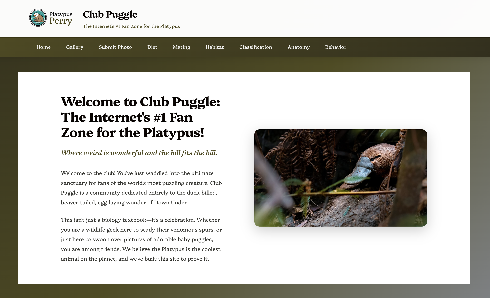

# Club Puggle - The Platypus Fan Site



Welcome to Club Puggle, the internet's #1 fan zone for the platypus! This is a modern, informational website dedicated to celebrating the world's most unique and puzzling creature.

## About

Club Puggle is a comprehensive resource for platypus enthusiasts, featuring detailed information about platypus anatomy, behavior, habitat, diet, reproduction, and classification. The site includes a community photo gallery where visitors can view and submit their own platypus photos.

## Features

- **Home Page**: Welcome section introducing the site's purpose and mission
- **Image Gallery**: Browse curated platypus photos and community submissions
- **Individual Image Pages**: Detailed view for each photo with descriptions
- **Photo Submission**: Community members can upload their own platypus photos
- **Educational Content**: Eight dedicated information pages covering:
  - Diet and feeding habits
  - Mating and reproduction
  - Natural habitat
  - Scientific classification
  - Anatomy and biology
  - Behavior and daily life
- **Responsive Design**: Mobile-friendly layout that works on all devices
- **Custom Typography**: Uses the Platypi font from Google Fonts

## Tech Stack

- **React 18.3** - UI library
- **TypeScript** - Type-safe JavaScript
- **Vite 6** - Fast build tool and dev server
- **React Router v7** - Client-side routing
- **CSS3** - Custom styling with gradients and animations

## Getting Started

### Prerequisites

- Node.js 16+ and npm

### Installation

1. Clone the repository:
```bash
git clone <repository-url>
cd platypus-best-animal
```

2. Install dependencies:
```bash
npm install
```

3. Start the development server:
```bash
npm run dev
```

4. Open your browser to `http://localhost:5173`

### Building for Production

```bash
npm run build
```

The built files will be in the `dist` directory.

## Project Structure

```
platypus-best-animal/
├── public/
│   └── images/           # Static image assets
│       ├── Logo.svg      # Site logo
│       ├── platypus-hero.jpg
│       └── platypus[1-4].*
├── src/
│   ├── components/
│   │   └── Layout.tsx    # Main layout with header and navigation
│   ├── pages/
│   │   ├── Home.tsx
│   │   ├── Gallery.tsx
│   │   ├── ImageDetail.tsx
│   │   ├── SubmitPhoto.tsx
│   │   ├── Diet.tsx
│   │   ├── Mating.tsx
│   │   ├── Habitat.tsx
│   │   ├── Classification.tsx
│   │   ├── Anatomy.tsx
│   │   └── Behavior.tsx
│   ├── App.tsx           # Main app component with routes
│   ├── App.css           # Global styles
│   └── main.tsx          # Entry point
└── index.html
```

## Color Palette

- **Primary Dark**: #0A0402 (Pitch Black)
- **Secondary Grey**: #82868E (Grey)
- **Accent Khaki**: #4F4B1E (Dark Khaki)
- **Dark Accent**: #312E1B (Darker Khaki)

## Features in Detail

### Community Photo Submissions

Users can submit platypus photos through the submission form. Photos are stored in browser localStorage as base64-encoded strings. Submissions include:
- Photo title
- Submitter name
- Location
- Description
- The photo itself (max 10MB)

Submitted photos appear in the main gallery with a "Community" badge and attribution.

### Image Gallery

The gallery displays both curated photos and community submissions. Each image is clickable and leads to a detailed page showing:
- Full-size image
- Title and caption
- Detailed description
- Navigation to previous/next images (for curated photos)
- Submitter attribution (for community photos)

## Browser Compatibility

Tested and working on:
- Chrome/Edge (latest)
- Firefox (latest)
- Safari (latest)

## Contributing

This is an educational project built as a functional MVP. Feel free to fork and enhance!

## License

This project is open source and available for educational purposes.

## Acknowledgments

- Platypus images sourced from various wildlife photography sources
- Font: Platypi by Google Fonts
- Built with love for the weirdest, most wonderful animal on Earth
